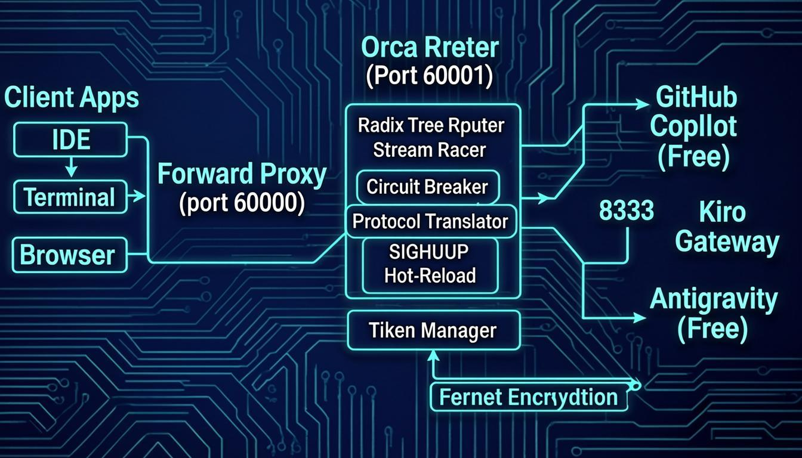
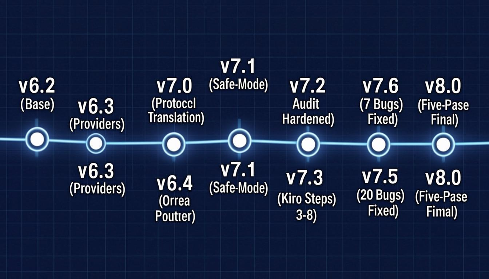

<div align="center">

# 🦉 OWL-ORCA

### AI Gateway with Stream Racing, Protocol Translation & Circuit Breakers

**Free AI for everyone. Race multiple providers. First byte wins.**

[](https://github.com/marktantongco/owl-orca)
[](LICENSE)
[](https://www.gnu.org/software/bash/)
[](https://www.python.org/)
[](https://github.com/marktantongco/owl-orca)

</div>

---

## 📸 Architecture Schematic

<p align="center">
  
</p>

*The OWL-ORCA system routes AI requests through a local proxy and router stack, racing multiple free-tier providers simultaneously. The first provider to respond wins — delivering the lowest possible latency without any cost to the user.*

---

## 🎯 Feature Infographic

<p align="center">
  
</p>

---

## 🚀 What is OWL-ORCA?

OWL-ORCA is a **self-hosted AI gateway** that aggregates free-tier AI providers into a single OpenAI-compatible API endpoint. It runs entirely on your local machine (optimized for 8GB RAM Ubuntu servers) and provides:

- **Stream Racing**: Fire requests to multiple providers simultaneously. The first byte wins, losers are cancelled. Zero wasted latency.
- **Protocol Translation**: Seamlessly converts between Anthropic and OpenAI SSE formats in real-time, chunk-by-chunk. No buffering.
- **Half-Open Circuit Breakers**: Automatic fault detection with probe-based recovery. If a provider fails 5 times, the circuit opens. After 60 seconds, it allows exactly one probe request to test recovery.
- **Radix Tree Routing**: O(1) path matching for all API routes. No regex, no loops — just tree traversal.
- **Safe-Mode**: Detects running IDEs and preserves active connections during updates. Updated code lands on disk and activates on next restart.
- **SIGHUP Hot-Reload**: Swap routing configuration without dropping a single TCP connection. `systemctl --user reload orca-router` is always safe.
- **Fernet Token Encryption**: OAuth tokens encrypted at rest using Fernet symmetric encryption with auto-generated keys.
- **Zero-Downtime Installs**: Atomic file writes prevent IDE file watcher crashes. Every file update uses write-to-temp + `mv` for inode swap.

---

## 📐 System Architecture

### Request Flow

```
┌─────────────┐     ┌──────────────────┐     ┌──────────────────────────────────────┐     ┌──────────────────┐
│   Client     │────▶│  Forward Proxy   │────▶│         Orca Router (port 60001)     │────▶│   AI Providers   │
│  (IDE/CLI)   │     │  (port 60000)    │     │                                      │     │                  │
│              │     │  HTTPS CONNECT   │     │  ┌─────────────┐  ┌───────────────┐  │     │  GitHub Copilot  │
│  OpenCode    │     │  tunnel with     │     │  │ Radix Tree  │  │ Stream Racer  │  │     │  (Free Tier)     │
│  Cline       │     │  domain bypass   │     │  │ O(1) Route  │  │ First-Byte    │  │     │                  │
│  Cursor      │     │  & upstream      │     │  │ Matching    │  │ Wins          │  │     │  Antigravity     │
│  VS Code     │     │  chaining        │     │  └─────────────┘  └───────────────┘  │     │  (Free Tier)     │
│  Terminal    │     │                  │     │                                      │     │                  │
└─────────────┘     │  Memory: 128MB   │     │  ┌─────────────┐  ┌───────────────┐  │     │  Kiro Gateway    │
                     │  Max Conns: 50   │     │  │ Circuit     │  │ Protocol      │  │     │  (AWS Builder)   │
                     └──────────────────┘     │  │ Breakers    │  │ Translation   │  │     └──────────────────┘
                                              │  │ Half-Open   │  │ Anthropic↔    │  │            │
                                              │  │ Probe-based │  │ OpenAI SSE    │  │            │
                                              │  └─────────────┘  └───────────────┘  │     ┌──────────────────┐
                                              │                                      │────▶│  Kiro Gateway    │
                                              │  ┌─────────────┐  ┌───────────────┐  │     │  (port 8333)     │
                                              │  │ SIGHUP      │  │ Token Mgr     │  │     │  256MB Memory    │
                                              │  │ Hot-Reload  │  │ Fernet Enc    │  │     └──────────────────┘
                                              │  └─────────────┘  └───────────────┘  │
                                              │                                      │
                                              │  Memory: 384MB   Total: 768MB hard cap│
                                              └──────────────────────────────────────┘
```

### Memory Budget (8GB RAM)

| Component | Memory Max | Memory High | Idle | Purpose |
|-----------|-----------|-------------|------|---------|
| Orca Router | 384 MB | 256 MB | ~80 MB | Stream multiplexing, routing, translation |
| Forward Proxy | 128 MB | 96 MB | ~15 MB | HTTPS CONNECT tunneling |
| Kiro Gateway | 256 MB | 192 MB | ~50 MB | AWS Builder ID + API proxy |
| **Total** | **768 MB** | **544 MB** | **~145 MB** | **~150 MB free for OS** |
| OS + Swap | — | — | — | 2GB swap guard ensures stability |

---

## 🏁 StreamRacer: First Byte Wins

The **StreamRacer** is the heart of OWL-ORCA's latency optimization. When a request arrives at the Orca Router with the `race` strategy, it simultaneously fires the request to ALL eligible providers. The provider that returns the first translated SSE chunk wins the race — all other streams are immediately cancelled.

### How It Works

```
                    ┌──────────────────┐
                    │  Client Request  │
                    └────────┬─────────┘
                             │
                    ┌────────▼─────────┐
                    │   Orca Router    │
                    │  (strategy=race) │
                    └────────┬─────────┘
                             │
              ┌──────────────┼──────────────┐
              │              │              │
     ┌────────▼────┐  ┌─────▼──────┐  ┌───▼──────────┐
     │  Copilot    │  │ Antigravity│  │    Kiro      │
     │  Stream 1   │  │ Stream 2   │  │  Stream 3    │
     └────────┬────┘  └─────┬──────┘  └───┬──────────┘
              │              │              │
              │    FIRST!    │              │
              │  (winner)    │     (cancel) │    (cancel)
              │              │              │
     ┌────────▼────┐        │              │
     │ Translate   │        │              │
     │ SSE→OpenAI  │        │              │
     └────────┬────┘        │              │
              │              │              │
              └──────────────┴──────────────┘
                             │
                    ┌────────▼─────────┐
                    │   Client Gets    │
                    │  Fastest Response│
                    └──────────────────┘
```

**Key properties:**
- Each chunk is tagged with its source `stream_id`
- After the race is decided, only chunks from the winning stream are yielded
- Loser streams are cancelled to free resources immediately
- Bounded queue (maxsize=5) provides backpressure on 8GB RAM
- Translation happens per-chunk with zero buffering — no full-response loading

---

## 🔄 Protocol Translation

OWL-ORCA performs **real-time, chunk-by-chunk SSE translation** between Anthropic and OpenAI formats. This is critical because free-tier providers use different API formats:

| Anthropic SSE Event | OpenAI Translation | Notes |
|---------------------|-------------------|-------|
| `message_start` | Role chunk (`"role": "assistant"`) | Starts the stream |
| `content_block_start` (text) | No output | Awaiting delta |
| `content_block_start` (tool_use) | Tool call start chunk | Includes function name |
| `content_block_delta` (`text_delta`) | Content delta chunk | Regular text content |
| `content_block_delta` (`thinking_delta`) | Reasoning delta chunk | Extended thinking → `reasoning_content` |
| `content_block_delta` (`input_json_delta`) | Tool call arguments chunk | Partial JSON arguments |
| `content_block_stop` | No output | Block complete |
| `message_delta` | Finish reason chunk | `stop_reason` → `finish_reason` |
| `message_stop` | `[DONE]` | Stream complete |
| `ping` | Acknowledged (no output) | Prevents timeout on long thinking |
| `error` | Error chunk (NOT silently dropped) | Visible to the client |

**Critical fix in v8.0**: Extended thinking blocks (`thinking_delta`) were previously silently dropped because the old code used `get("text")` instead of `get("thinking")`. Now they correctly map to `delta.reasoning_content` (the emerging o1-style standard).

---

## 🛡️ Circuit Breakers

Each provider has its own **half-open circuit breaker** that protects against cascading failures:

```
CLOSED ────(5 consecutive failures)────▶ OPEN
  ▲                                        │
  │                                        │ (60 second cooldown)
  │                                        ▼
  └──(probe succeeds)─────────── HALF_OPEN
                                     │
                              (probe fails)
                                     │
                                     ▼
                                  OPEN
```

**Decay factor**: Instead of resetting failures to 0 on a single success (which masks intermittent failures), each success reduces the failure count by 1. A provider that fails 80% of the time will still eventually trip the circuit because failures accumulate faster than they decay.

---

## 📋 Step-by-Step Installation Guide

### Prerequisites

- **Ubuntu 22.04/24.04 LTS** (or any Linux with systemd)
- **8 GB RAM** minimum (optimized for this constraint)
- **Python 3.10+** (required for type hints and modern asyncio)
- **Root/sudo access** (for swap, systemd, and package installation)

### Quick Install

```bash
# One-line install (recommended)
curl -fsSL https://raw.githubusercontent.com/marktantongco/owl-orca/main/install.sh | bash

# Or clone and run locally
git clone https://github.com/marktantongco/owl-orca.git
cd owl-orca
chmod +x install.sh
./install.sh
```

### Install with Options

```bash
# Skip forward proxy (if you don't need HTTPS tunneling)
./install.sh --skip-proxy

# Skip Kiro Gateway (if you only want Copilot + Antigravity)
./install.sh --skip-kiro

# Configure provider auth interactively during install
./install.sh --with-providers

# Upgrade existing installation (preserves config and tokens)
./install.sh --upgrade

# See what would be done without making changes
./install.sh --dry-run

# Pin to a specific version
./install.sh --version=8.0.0

# Check installation status
./install.sh --status

# Full uninstall (with confirmation)
./install.sh --uninstall

# Force uninstall (no confirmation, for automation)
./install.sh --uninstall-force
```

### 12-Step Installation Pipeline

Each step has a specific purpose and is designed to be idempotent (safe to re-run):

| Step | Name | Purpose | What It Does |
|------|------|---------|--------------|
| **1** | System Prerequisites | Ensures required software is installed | Checks for python3, pip3, systemctl, curl, git; validates Python 3.10+; detects OS package manager; enables systemd linger for rootless services; installs system packages (python3-pip, python3-venv, libffi-dev, libssl-dev, etc.); optionally installs Podman for containerized sidecars |
| **2** | Swap Guard | Prevents OOM on 8GB RAM | Checks total swap; if < 1GB, creates a 2GB swapfile with proper permissions (0600) and adds it to /etc/fstab for persistence across reboots |
| **3** | Memory Accounting | Enables per-service memory tracking | Configures systemd `DefaultMemoryAccounting=yes` so that MemoryMax/MemoryHigh limits are enforced on all user services |
| **4** | Directory Structure | Creates the runtime file tree | Creates `~/.owl-agent/` with subdirectories: `bin/`, `bin/utils/`, `config/`, `logs/`, `cache/`, `scripts/`, `venv/`; also creates `~/.config/opencode/` and `~/.local/bin/`; sets 0700 permissions on config and install dirs |
| **5** | Python Environment | Isolates Python dependencies | Creates a Python virtual environment with `httpx[http2]`, `aiohttp`, `aiofiles`, `cryptography`; includes retry logic (3 attempts with exponential backoff) and validates imports after installation |
| **6** | Core Scripts | Writes all Python modules and config | Writes 7 embedded Python modules (see below) + 2 JSON config files using atomic writes (write-to-temp + mv) to prevent file corruption; validates Python syntax of all modules after writing |
| **7** | Zero-Downtime Detection | Detects running IDEs for Safe-Mode | Scans for running IDE processes (OpenCode, Cline, Cursor, VS Code, etc.); if detected, sets `OPENCODE_ACTIVE=true` to preserve connections during service restarts |
| **8** | Systemd Services | Deploys user-level services | Creates 3 systemd user services: `orca-router.service` (384MB mem limit, SIGHUP support), `owl-proxy.service` (128MB mem limit), `kiro-gateway.service` (256MB mem limit); uses INSTALL_DIR variable for custom paths |
| **9** | Kiro Gateway | Sets up AWS Builder ID access | Clones kiro-gateway repo with retry; detects glibc/musl; creates dedicated Python venv; downloads kiro-cli binary; attempts AWS Builder ID OIDC; writes .env with API key; deploys systemd service |
| **10** | OpenCode Configuration | Injects owl-orca-virtual provider | Uses state-machine JSONC parser (not regex) to safely merge provider config into `opencode.jsonc`; atomic write prevents corruption; also configures MCP server for tool calling |
| **11** | CLI Wrappers | Creates convenient shell commands | Creates `owl-proxy` (sets HTTP_PROXY env), `owl-router` (runs Orca Router), `owl-token` (manages OAuth tokens) in `~/.local/bin/` |
| **12** | Safe Activation | Starts services with protection | Reloads systemd; enables services; uses Safe Service Manager to skip restarts if IDE is running; runs health checks with 10 retries (30s timeout); optionally runs provider authentication; configures log rotation (daily, 7-day retention, 50MB max) |

### Embedded Python Modules

Step 6 writes these Python modules into `~/.owl-agent/bin/` and `~/.owl-agent/bin/utils/`:

| Module | Location | Purpose | Key Classes/Functions |
|--------|----------|---------|----------------------|
| `radix_tree.py` | `bin/utils/` | O(1) path matching | `RadixTreeRouter`, `RadixNode`, `add_route()`, `match()`, `remove_route()`, `list_routes()` |
| `circuits.py` | `bin/utils/` | Half-open circuit breakers | `HalfOpenCircuit`, `CircuitBreakerRegistry`, `can_execute()`, `record_success()`, `record_failure()` |
| `jsonc_utils.py` | `bin/utils/` | Safe JSONC parsing | `strip_jsonc_comments()`, `load_jsonc()`, `save_json_atomic()` |
| `provider_router.py` | `bin/utils/` | Provider selection logic | `ProviderRouter`, `select()`, `get_fallback()` |
| `forward_proxy.py` | `bin/` | HTTPS CONNECT proxy | `handle_connect()`, `handle_http()`, `pipe()`, domain bypass |
| `payload_translator.py` | `bin/` | Protocol translation | `PayloadTranslator`, `StreamTranslator`, `anthropic_sse_to_openai()` |
| `token_manager.py` | `bin/` | OAuth token management | `TokenManager`, `DeviceFlowAuth`, `TokenStore`, `TokenEncryption` (Fernet) |
| `orca_router.py` | `bin/` | The routing brain | `OrcaRouter`, `StreamRacer`, `handle_request()`, `_handle_race()`, `_handle_canary()` |

---

## ⏱️ Version Timeline

<p align="center">
  
</p>

### Historical Changes

| Version | Codename | Date | Key Changes | Bugs Fixed |
|---------|----------|------|-------------|------------|
| **6.2** | Base | 2025-05 | Podman rootless, swap guard, memory accounting, directory structure, Python venv | — |
| **6.3** | Provider Integration | 2025-05 | GitHub Copilot Free (device flow), Antigravity Free (OAuth + API key), token manager with Fernet encryption | — |
| **6.4** | Orca-Router | 2025-05 | Stream Racing (first-byte-wins), Radix Tree routing, half-open circuit breakers, provider router | — |
| **7.0** | Protocol Translation | 2025-06 | Live Anthropic ↔ OpenAI SSE translation, zero-copy chunk-by-chunk streaming, payload translator | — |
| **7.1** | Safe-Mode | 2025-06 | Atomic file swaps, IDE connection preservation, safe service manager, SIGHUP hot-reload | — |
| **7.2** | Audit-Hardened | 2025-06 | All prior audit fixes applied, JSONC state-machine parser, port conflict detection | — |
| **7.3** | Two-Pass-Final | 2025-06 | Kiro Gateway Steps 3-8 (venv, OIDC, .env, systemd, health verification, opencode wiring) | **7 bugs** |
| **7.4** | Two-Pass-Final+ | 2025-06 | Additional hardening, improved error handling, pip retry logic | **7 additional bugs** |
| **7.5** | Three-Pass-Final | 2025-06 | Dedup, dead code removal, import path fixes, httpx connection pooling | **20 new bugs** |
| **7.6** | Four-Pass-Final | 2025-06 | Optimization, memory limit tuning, backup cleanup, fsync durability | **12 new bugs** |
| **8.0** | Five-Pass-Final | 2025-06 | OWL_INSTALL_DIR consistency, dead code removed, SIGHUP async I/O, Kiro error handling, CLI wrapper fixes | **15 new bugs** |

---

## 📊 Feature Matrix

### Provider Comparison

| Feature | GitHub Copilot (Free) | Antigravity (Free) | Kiro Gateway (AWS) |
|---------|----------------------|--------------------|--------------------|
| **API Format** | OpenAI | Anthropic | OpenAI |
| **Auth Method** | Device Flow (browser) | OAuth PKCE / API Key | AWS Builder ID OIDC |
| **Token Storage** | Fernet encrypted | Fernet encrypted | .env (0600 permissions) |
| **Streaming** | SSE (OpenAI native) | SSE (requires translation) | SSE (OpenAI native) |
| **Extended Thinking** | Not supported | Supported (thinking_delta) | Not supported |
| **Tool Calling** | Supported | Supported (input_json_delta) | Supported |
| **Circuit Breaker** | Yes (5 failures → open) | Yes (5 failures → open) | Yes (5 failures → open) |
| **Canary Weight** | 90 (default) | 10 (default) | Fallback |
| **Memory Budget** | — | — | 256 MB |
| **Auto-Fallback** | Falls back to Kiro | Falls back to Kiro | Last resort |

### Routing Strategy Comparison

| Strategy | Description | Use Case | Latency | Cost |
|----------|-------------|----------|---------|------|
| **race** | Fire ALL providers, first byte wins | Chat completions (default) | Lowest possible | Higher (multiple requests) |
| **single** | Route to first available with closed circuit | Model listing, simple queries | Normal | Normal |
| **canary** | Weighted random selection (A/B testing) | Gradual rollout of new models | Normal | Normal |
| **fallback** | Try in order, fall back on circuit-open | Critical paths needing reliability | Variable | Normal |

---

## 🔧 Configuration

### Environment Variables

| Variable | Default | Purpose |
|----------|---------|---------|
| `OWL_INSTALL_DIR` | `~/.owl-agent` | Custom installation directory |
| `OWL_KIRO_DIR` | `~/Documents/proxy/kiro-gateway` | Kiro Gateway source directory |
| `OWL_KIRO_API_KEY` | `kiro-gateway-8333` | API key for Kiro Gateway |
| `OWL_PROXY_HOST` | `127.0.0.1` | Forward proxy bind address |
| `OWL_PROXY_PORT` | `60000` | Forward proxy port |
| `OWL_PROXY_URL` | `http://127.0.0.1:60000` | Proxy URL for outbound requests |
| `OWL_CONNECT_TIMEOUT` | `15` | HTTPS CONNECT timeout (seconds) |
| `OWL_MAX_CONNECTIONS` | `50` | Max concurrent proxy connections |
| `UPSTREAM_PROXY` | (empty) | Upstream proxy for chaining |
| `OWL_VERSION` | `8.0.0` | Version reported by health endpoint |

### Config Files

| File | Location | Purpose |
|------|----------|---------|
| `providers.json` | `~/.owl-agent/config/` | Provider definitions (base_url, format, models) |
| `routes.json` | `~/.owl-agent/config/` | Routing rules (pattern, strategy, targets, weights) |
| `tokens.enc` | `~/.owl-agent/config/` | Fernet-encrypted OAuth tokens |
| `.key` | `~/.owl-agent/config/` | Fernet encryption key (0600 permissions) |
| `kiro-gateway.env` | `~/.owl-agent/config/` | Kiro Gateway runtime environment |
| `logrotate.conf` | `~/.owl-agent/config/` | Log rotation configuration |
| `opencode.jsonc` | `~/.config/opencode/` | OpenCode provider configuration |
| `mcp.json` | `~/.config/opencode/` | MCP server configuration |

### Service Management

```bash
# Check status of all services
./install.sh --status

# Start/stop individual services
systemctl --user start orca-router.service
systemctl --user stop orca-router.service
systemctl --user restart orca-router.service

# Hot-reload config WITHOUT dropping connections (always safe)
systemctl --user reload orca-router.service

# Or via HTTP endpoint
curl -X POST http://127.0.0.1:60001/admin/reload

# View logs
journalctl --user -u orca-router.service -f
journalctl --user -u owl-proxy.service -f
journalctl --user -u kiro-gateway.service -f

# Token management
owl-token auth --provider copilot      # GitHub Copilot device flow
owl-token auth --provider antigravity   # Antigravity OAuth
owl-token status                        # Check all token status
owl-token list                          # List configured providers

# Run command with proxy environment
owl-proxy curl https://api.example.com
```

---

## 🐛 Known Errors & Pending Fixes

### Fixed in v8.0 (Five-Pass Audit)

| Bug ID | Description | Fix | Version Fixed |
|--------|-------------|-----|---------------|
| B1 | SSE extended thinking blocks silently dropped | Map `thinking_delta` → `reasoning_content` with correct `get("thinking")` accessor | v7.3 |
| B2 | Uninstall `opencode.jsonc` cleanup used naive regex | State-machine JSONC parser preserves URLs in strings | v7.3 |
| B3 | glibc/musl detection logic inverted | Check `ldd --version` output for "musl" string instead of exit code | v7.3 |
| B4 | `\|\| true` swallowed pip/tar extraction failures | Retry logic with visible error output; Kiro pip failure now hard error | v7.3 |
| B5 | Regex on JSON for .env configuration | Shell variable expansion (safe for simple key=value) | v7.3 |
| B6 | Shell variables interpolated into Python heredocs | Quoted heredoc `<<'PYEOF'` prevents expansion; variables passed via environment | v7.3 |
| B7 | Step 8 Python code incomplete/truncated | Completed implementation with proper error handling | v7.3 |
| B8 | httpx client connections leak on shutdown | Added `aclose()` in `finally` block of `run_orca_server()` | v7.4 |
| B9 | SIGHUP reload blocked when IDE is running | SIGHUP is always safe (no connection drops); removed blocking | v7.4 |
| B10 | Config directories lack secure permissions | `chmod 700` on CONFIG_DIR and INSTALL_DIR | v7.4 |
| B11 | `strip_jsonc_comments` duplicated ~70 lines x3 | Extracted to shared `jsonc_utils.py` module | v7.4 |
| B12 | Import path errors for `circuits` module | `try/except` for both relative and absolute imports | v7.4 |
| B13 | Shutdown task garbage-collected before completion | Module-level `_active_tasks` set holds strong reference | v7.4 |
| B14 | Temp file naming inconsistent (~20 repetitions) | Centralized `_mktemp()` helper function | v7.5 |
| B15 | Old backup files accumulate indefinitely | `cleanup_old_backups()` removes files older than 7 days | v7.5 |
| B16 | Missing `model`/`messages` validation | OpenAI-compliant 400 error for missing required fields | v7.5 |
| B17 | MCP `notifications/cancelled` not handled | Acknowledge and log per MCP spec | v7.5 |
| B18 | MCP `owl_status` uses `subprocess+curl` | Replaced with `urllib.request` (always available) | v7.5 |
| B19 | OIDC token stored in plaintext in .env | Warn user explicitly; 0600 permissions on .env file | v7.5 |
| B20 | Token cache shared across class instances | Moved to instance variables in `__init__` | v7.5 |
| N1 | Unused `ENRICH` variable parsed but never acted on | Removed variable and flag | v8.0 |
| N2 | Forward proxy hardcodes `~/.owl-agent` | Use `OWL_INSTALL_DIR` environment variable | v8.0 |
| N3 | Token manager hardcodes `~/.owl-agent` | Use `OWL_INSTALL_DIR` environment variable | v8.0 |
| N4 | JSONC fallback still uses fragile regex | Inline state-machine fallback added | v8.0 |
| N5 | Task garbage collection pattern insufficient | Module-level `_active_tasks` set pattern | v8.0 |
| N6 | Systemd services hardcode `~/.owl-agent` | Expand `INSTALL_DIR` at file creation time | v8.0 |
| N7 | Kiro pip install failure leaves broken gateway | Skip kiro entirely on failure; don't continue broken | v8.0 |
| N8 | SIGHUP file I/O blocks event loop on slow FS | Thread executor for I/O, atomic swap in event loop | v8.0 |
| N9 | All-streams-fail raises non-standard exception | Yield OpenAI-compliant error chunk instead | v8.0 |
| N10 | No fsync before atomic rename | `sync -f` before `mv` for power-failure durability | v8.0 |
| N11 | .env values not quoted (special char risk) | `printf` with quoted values protects against special chars | v8.0 |
| N12 | Port validation missing for Python fallback | Integer range check before socket bind | v8.0 |

### Pending / Known Limitations

| Issue | Description | Status | Workaround |
|-------|-------------|--------|------------|
| Antigravity OAuth | PKCE flow requires manual code paste from browser | By design | Use `--api-key` flag for direct API key auth |
| Kiro Gateway | Requires `kiro-gateway` repo from GitHub (Jwadow/kiro-gateway) | By design | Skip with `--skip-kiro` if not needed |
| Token Refresh | Copilot device flow tokens expire after 24h; no auto-refresh | Pending | Re-run `owl-token auth --provider copilot` |
| Concurrent Installs | Running install.sh twice simultaneously may cause race conditions | Known | Use `flock` or run sequentially |
| Podman Migration | Docker → Podman migration mentioned but not fully implemented | Planned | Use `--skip-proxy` and run Docker manually |
| Windows Support | No Windows support (systemd required) | Not planned | Use WSL2 with systemd enabled |

---

## 🔐 Security Considerations

- **Tokens encrypted at rest**: OAuth tokens stored in `tokens.enc` using Fernet symmetric encryption with auto-generated keys
- **Secure file permissions**: Config directory (0700), token files (0600), encryption keys (0600)
- **Local-only binding**: All services bind to `127.0.0.1` (localhost only) by default
- **No telemetry**: Zero outbound analytics, tracking, or phone-home behavior
- **Atomic writes**: All file operations use write-to-temp + rename to prevent corruption
- **Bypass domains**: Forward proxy automatically bypasses provider domains to avoid routing loops

---

## 🧩 Extending OWL-ORCA

### Adding a New Provider

1. Edit `~/.owl-agent/config/providers.json` to add the provider definition:
```json
{
  "my-provider": {
    "base_url": "https://api.my-provider.com",
    "format": "openai",
    "models": {
      "my-model": {"context_window": 128000, "max_tokens": 8192}
    }
  }
}
```

2. Edit `~/.owl-agent/config/routes.json` to add routing targets:
```json
{
  "pattern": "v1/chat/completions",
  "strategy": "race",
  "targets": [
    {"provider": "my-provider", "model": "my-model", "weight": 50}
  ]
}
```

3. Hot-reload the configuration without dropping connections:
```bash
systemctl --user reload orca-router.service
# Or: curl -X POST http://127.0.0.1:60001/admin/reload
```

### Adding Token Auth for a New Provider

1. Extend `token_manager.py` with a new auth class (e.g., `MyProviderAuth`)
2. Add the provider name to the `authenticate` command choices
3. The token will be automatically loaded by the router's `_load_tokens()` method

---

## 🤝 Contributing

1. Fork the repository
2. Create a feature branch (`git checkout -b feature/amazing-feature`)
3. Run the full install script in dry-run mode first (`./install.sh --dry-run`)
4. Test with `--status` after changes
5. Submit a pull request

---

## 📄 License

MIT License — Free for personal and commercial use.

---

<div align="center">

**OWL-ORCA v8.0.0** — Five-Pass-Audit-Final Edition

*Stream Racing * Protocol Translation * Safe-Mode * Radix Routing * Circuit Breakers * Zero-Downtime*

</div>
